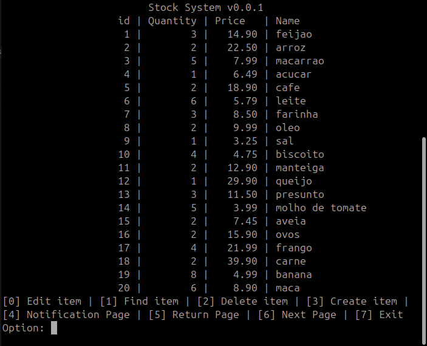
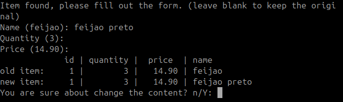
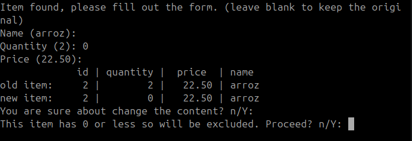
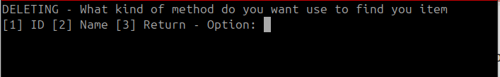
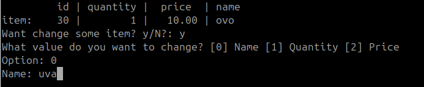
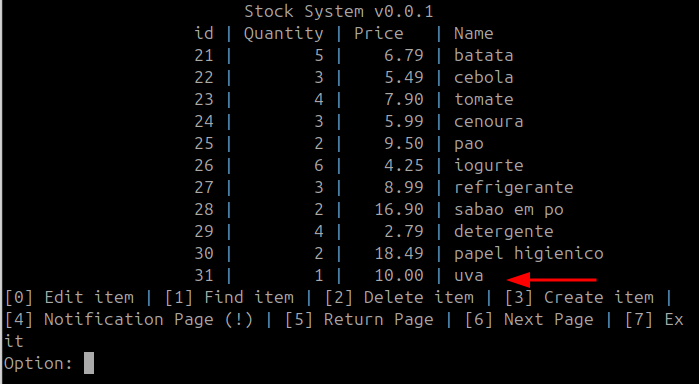
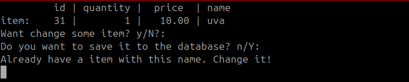
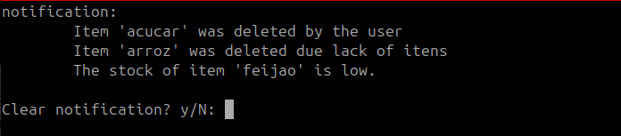

# Stock System

This application is the resolution of a challenge that a friend of mine sent to me. Consist in creating a small stock system only using the standard library without using any AI to help.

## The challenge

>
>
>
> Mr. Marcos's Shop:
>
> You will develop an inventory management system for a shop. Through the system's terminal interface, the user must be able to choose from the following options:
>
> - add item
> - delete item
> - edit item
> - search for item
> - exit
>
> Every item has the following properties:
>
> - ID
> - Name
> - Quantity
> - Price
>
> To create an item, you input the item's name, quantity, and price. If an item with that name does not already exist in the database, an ID will be generated for it, and it must be stored in the database.
>
> To delete an item, the user must provide the item's name or ID; if the item exists in the database, it must be deleted.
>
> To search for an item, the user must choose whether to view all items or search for a specific one. If the user wants to view a specific item, they must enter the item's ID or name; if it exists, all its information should be displayed.
>
> To edit an item, the user must search for it by name or ID; if the item exists, they can choose which specific piece of information to modify.
>
> Notes:
>
> - Under no circumstances may two items with the same name exist in the database.
> - If an item has 3 or fewer units remaining, the system must notify the user that stock is running low.
> - If an item's stock reaches zero units, it must be removed from the database, and the user must be notified.
> - If the user exits the program at any point, all recent modifications must be saved for the next session.
> - The only "database" allowed is a text file (.txt) for storing information.
> - The path to the text file must be specified in an ".env" environment variable file; hardcoding the path directly into the source code is not permitted.
> - The code must be written entirely in standard C, without using any non-native libraries.
> - Any use of AI will result in the member's removal from the project.
> - The program should only close if the user explicitly chooses to exit.
> - The program must be submitted via a link to a public GitHub repository.
> - Make a nice README for me, will ya?

## How to run this project

### Windows

To compile this project in Windows, you need to first install the Build Tools for Visual Studio 2022

After that, you can run the command

```bash
cl main.c
```

This will make a main.exe that you can run by simply executing:

```jsx
main
```

### Linux

To compile this project in Linux, you can just run

```jsx
gcc main.c -o main
```

That you can run using the command

```jsx
./main
```

## Usage

The program's default screen shows the items and some options that the user can choose

<p align="center">
  
</p>

### Edit item

The first option of the list, this option allows the user to change some iten’s property. The property that the user can change is

<p align="center">
  
</p>

- Name
- Quantity
- Price

If the quantity is less than 3, the system will create a notification.

### Auto-exclusion

If the quantity has less or equal to 0, the system will automatically delete the item and create a notification about the automatic exclusion

<p align="center">
  
</p>


### Find item

This method allows the user to find a specific item using its ID or the name.

<p align="center">
  
</p>


- Finding an item by ID

  After choosing option 1, the system will let the user write an ID

  <p align="center">
  
</p>


- Finding an item by name

  <p align="center">
  
</p>


  > The search by name funcionally is not case sensitive, that is `Feijao` and `feijao` is the same
>

When a valid ID or name is provided, the system will show the screen allowing the user to return to the home page or edit that item.

<p align="center">
  
</p>


### Delete item

This option lets the user delete an item at any moment.

<p align="center">
  
</p>


After giving a valid ID or name, the system will ask if the user really wants to delete the item

<p align="center">
  
</p>


And if the answer is `y`, the system will delete the item and create a notification

### Create item

This option lets the user create an item at any moment. After choosing this option, a small form will open and let the user fill

<p align="center">
  
</p>


After all items have been filled in correctly, a resume screen will appear

<p align="center">
  
</p>


The user can change a value without restarting the process by sending `y`

<p align="center">
  
</p>


Whenever everything is great, the user can save it in the database

<p align="center">
  
</p>


And the item will persist

<p align="center">
  
</p>


Still in item creation, if the user tries to create an item that already exists, the system will show an alert and ask the user to change the name

<p align="center">
  
</p>


### Notification Page

The page gathers all notifications issued by the system. The notification can be:

- Item deleted
- Item auto-deleted
- Item with low quantity

<p align="center">
  
</p>


The notification can be cleared at any given moment, and after, it will show the default empty notification screen

<p align="center">
  
</p>


### Return Page

The home screen shows all the items paginated. To return to the page, the user can use this option

### Next Page

Same to return but will move the page forward

### Exit

Just close the program.

## Bibliography

This program was made without any use of AI, such as Gemini, ChatGPT, Claude, or whatever AI exists in the market, but the knowledge was acquired from blogs, books, and forums. Here are all the websites/books that make this project possible

- Websites:

https://www.ibm.com/docs/en/i/7.4.0

https://cppreference.com/

https://www.geeksforgeeks.org/

https://www.programiz.com/dsa/queue

https://www.reddit.com/

https://en.wikipedia.org/

https://pubs.opengroup.org/

https://gcc.gnu.org/

https://stackoverflow.com

- Books:

K. N. King - C Programming